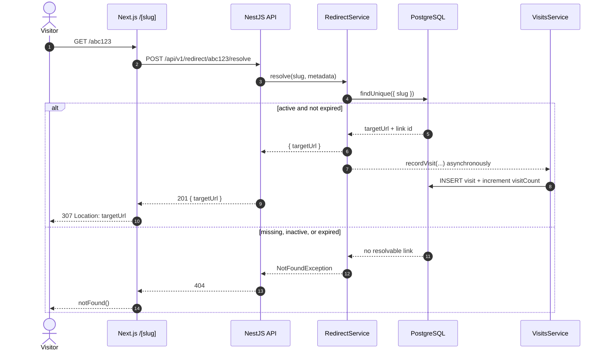

# Implementation Notes — Shortly URL Shortener

Complete technical documentation for the DeepOrigin full-stack task.

This document explains **what** was built, **how** it works, and — most importantly —
**why** each decision was made. Where a choice involved a genuine trade-off, both sides
are stated along with the conditions under which the other option would win.

---

## Table of contents

1. [Overview](#1-overview)
2. [Architecture](#2-architecture)
3. [Technology choices](#3-technology-choices)
4. [Data model](#4-data-model)
5. [Request lifecycles](#5-request-lifecycles)
6. [Reusable function catalogue](#6-reusable-function-catalogue)
7. [API reference](#7-api-reference)
8. [Frontend structure](#8-frontend-structure)
9. [Security](#9-security)
10. [Rate limiting](#10-rate-limiting)
11. [Analytics and the dashboard](#11-analytics-and-the-dashboard)
12. [Observability](#12-observability)
13. [Testing](#13-testing)
14. [Docker and deployment](#14-docker-and-deployment)
15. [Interview trade-offs](#15-interview-trade-offs)
16. [Known limitations and next steps](#16-known-limitations-and-next-steps)

---

## 1. Overview

Shortly turns a long URL into a short one, redirects visitors to the original, and reports
how popular each link is.

**Core loop**

```
User pastes https://some.place.example.com/foo/bar/biz
      ↓  POST /api/v1/links
Backend validates the URL, generates a unique slug, persists a Link row
      ↓
User receives http://localhost:3000/abc123  (one click to clipboard)
      ↓
Visitor opens the short URL
      ↓  Next.js [slug] route resolves it server-side
Backend records a Visit and returns the destination
      ↓
Visitor is redirected (307) to the original URL
      ↓
Owner sees the click on the dashboard
```

**Design principles applied throughout**

| Principle | How it shows up |
|---|---|
| Logic lives in small, pure, reusable functions | `common/utils/*` — no framework or DB coupling, unit-tested in isolation |
| One source of truth per rule | Slug rules, URL rules and pagination bounds each exist in exactly one module |
| Validate at the edge, trust nothing after | DTOs + `ValidationPipe` reject malformed input before a controller runs |
| Fail loudly at start-up, gracefully at runtime | Env validation crashes on boot; analytics failures never break a redirect |
| The database enforces its own invariants | Slug uniqueness is an index, not an application check |
| Anonymous use is first-class | Shortening never requires an account |

---

## 2. Architecture

```
                        ┌──────────────────────────────────────┐
   Browser ────────────▶│  Next.js frontend        :3000       │
                        │                                      │
   http://host/abc123 ──▶  app/[slug]/page.tsx  (server)       │
                        │  app/page.tsx         (shorten form) │
                        │  app/dashboard        (analytics)    │
                        └──────────────┬───────────────────────┘
                                       │  REST, JSON
                                       ▼
                        ┌──────────────────────────────────────┐
                        │  NestJS API              :4000       │
                        │                                      │
                        │  AuthModule    JWT register / login  │
                        │  LinksModule   CRUD + custom slugs   │
                        │  RedirectModule slug → destination   │
                        │  VisitsModule  click tracking        │
                        │  AnalyticsModule aggregation         │
                        │                                      │
                        │  Global: throttler · exception filter │
                        │          validation pipe · logging   │
                        └──────────────┬───────────────────────┘
                                       │  Prisma
                                       ▼
                        ┌──────────────────────────────────────┐
                        │  PostgreSQL              :5433       │
                        │  users · links · visits              │
                        └──────────────────────────────────────┘
```

The API tier is horizontally scalable, though that is **opt-in**: the default
`docker compose up --build` runs the single-instance stack above. Layering on
`docker-compose.scale.yml` clears the backend's port mapping and adds nginx, and
the shape becomes:

```
   Browser ──▶ nginx (lb) :4000 ──┬──▶ backend-1 ─┐
                                  ├──▶ backend-2 ─┤   PgBouncer      PostgreSQL
                                  ├──▶    …       ┼──▶  :6432   ────▶  :5433
                                  └──▶ backend-6 ─┘  (20 real conns)
                                        │
                                        └──────────▶ Redis :6379
                                                     shared rate-limit counters

   A one-shot `migrate` job applies the schema once — connecting DIRECTLY to
   Postgres, bypassing PgBouncer — before any replica starts.
```

Three pieces make this work:

- **nginx** owns the published host port (only one container can) and resolves
  `backend` through Docker's embedded DNS on a short TTL, so replicas can come
  and go without restarting it. It lives in the scaling overlay rather than the
  base stack because it exists *purely* to work around host-port uniqueness —
  and in a real deployment it would not exist at all, a managed load balancer
  filling the role with redundancy and TLS termination.
- **Redis** holds the rate-limit counters. Per-process counters would let an
  N-replica deployment serve N× the configured limit.
- **PgBouncer** decouples database connections from replica count. Prisma opens
  ~25 connections per process, so six unpooled replicas would need 150 against a
  100-connection budget. Measured through the pooler: **20 at three replicas, 20
  at six.**

Full detail and measurements in [`SCALING.md`](SCALING.md).

### Why short links resolve on the *frontend* domain

The brief specifies `https://{domain}/abc123`. Two placements were possible:

| Option | Consequence |
|---|---|
| Backend serves `/{slug}` | Short URLs carry the API's host and port (`:4000`), which is not what a user wants to share |
| **Frontend serves `/{slug}`** ✅ | Short URLs live on the same clean domain as the app, exactly matching the brief |

The Next.js catch-all route (`app/[slug]/page.tsx`) is a **server component**, which matters:

- the redirect is issued before any HTML reaches the browser — no flash of an intermediate page;
- the visitor's IP and User-Agent are read server-side and forwarded to the API, so tracking
  cannot be blocked or forged by client-side script;
- **short links work with JavaScript disabled**.

Route precedence resolves collisions: Next matches static segments (`/links`, `/dashboard`)
before the dynamic one, and the backend's reserved-slug list prevents anyone from claiming
those names in the first place.

The backend *also* exposes `GET /api/v1/redirect/:slug`, which issues a real 302. This keeps
the API independently usable (curl, tests, or pointing a short domain straight at it).

---

## 3. Technology choices

| Layer | Choice | Why |
|---|---|---|
| Backend framework | **NestJS** | Named as DeepOrigin's internal stack. Its DI container makes the service layer trivially testable, and guards/filters/interceptors express cross-cutting concerns without touching feature code |
| ORM | **Prisma** | Generates types from the schema, so a column rename becomes a compile error rather than a runtime one. Its migration workflow is straightforward and its query API is readable |
| Database | **PostgreSQL** | Named as the internal stack. Real unique constraints, partial indexes and transactions — all of which this design leans on |
| Frontend | **Next.js App Router** | Named as the internal stack. Server components are what make the redirect route work without a client-side flash |
| Styling | **Tailwind CSS v4** | Utility classes keep styling next to markup; the v4 CSS-first config puts design tokens in `globals.css` with no JS config file |
| Auth | **JWT + Passport** | Stateless, so the API scales horizontally with no shared session store |
| Password hashing | **bcrypt** | Deliberately slow and self-salting. `bcryptjs` (pure JS) avoids native build steps in Alpine containers |
| Charts | **Hand-written SVG** | The app needs two chart forms. A dependency-free implementation keeps the bundle small and gives full control over accessibility and hover behaviour |
| Slug generation | **`crypto.randomInt`** | Slugs are public identifiers; `Math.random` is predictable and would let anyone enumerate every link |

### Deliberately avoided

- **`nanoid`** — v5 is ESM-only, which fights CommonJS Nest builds. A 12-line generator over
  an explicit alphabet is clearer and dependency-free.
- **`ua-parser-js`** — the dashboard needs a coarse browser/OS/device split, not a full
  device database. ~80 lines removes a supply-chain dependency.
- **A charting library** — Recharts and friends add 100 kB+ for two chart forms.
*(Redis was on this list originally, on the grounds that an in-memory rate limiter is
correct for a single instance. It has since been added — see
[`SCALING.md`](SCALING.md) — because the app now runs multiple backend replicas, where
per-process counters silently multiply the configured limit. The in-memory path remains
the default when `REDIS_URL` is unset, so tests and local development stay
dependency-free.)*

---

## 4. Data model

```prisma
User  ──1:N──▶  Link  ──1:N──▶  Visit
```

The exact columns and indexes live in
[`REFERENCE.md` → Database schema](REFERENCE.md#database-schema), so there is one
lookup table for the contract. This section focuses on the design choices behind
that shape.

### Two decisions worth explaining

**Why store raw `Visit` rows instead of just a counter?**
A counter answers "how many?" and nothing else. The brief asks for a dashboard showing *how
popular* links are, which means trends over time, traffic sources and audience. Those
questions cannot be reconstructed from an integer. Raw events keep every future question
answerable.

**Then why *also* keep `visitCount`?**
Because the link list renders a visit count per row. Without the counter, that is a
`COUNT(*)` subquery per row on the largest table in the schema. Reading one integer is
orders of magnitude cheaper. The counter is a cache; the `visits` table remains the source
of truth. Both are written in a single transaction, so they cannot diverge:

```ts
await this.prisma.$transaction([
  this.prisma.visit.create({ data: { linkId, /* … */ } }),
  this.prisma.link.update({
    where: { id: linkId },
    data: { visitCount: { increment: 1 }, lastVisitedAt: occurredAt },
  }),
]);
```

`{ increment: 1 }` is an atomic server-side update, so two simultaneous clicks cannot lose
a count the way a read-modify-write would.

---

## 5. Request lifecycles

### 5.1 Creating a short link

```mermaid
sequenceDiagram
    autonumber
    actor User
    participant API as NestJS API
    participant Links as LinksService
    participant Slug as slug.util
    participant DB as PostgreSQL

    User->>API: POST /api/v1/links
    API->>API: throttle, optional auth, DTO validation
    API->>Links: create(dto, user?)
    Links->>Links: validateUrl()
    alt custom slug
        Links->>Slug: validateSlug(slug)
    else generated slug
        Links->>Slug: generateSlug() using crypto.randomInt
    end
    Links->>DB: INSERT link(slug, targetUrl, ownerId?)
    alt unique slug
        DB-->>Links: Link row
        Links-->>API: LinkDto
        API-->>User: 201 { shortUrl, ... }
    else generated slug collision
        DB-->>Links: P2002 unique violation
        Links->>Slug: generate a different slug
        Links->>DB: retry INSERT
    else custom slug collision
        DB-->>Links: P2002 unique violation
        Links-->>API: ConflictException
        API-->>User: 409 slug already taken
    end
```

```
POST /api/v1/links  { "url": "example.com/foo", "slug": "my-link"? }
  │
  ├─ ThrottlerProxyGuard      10 requests/min per client
  ├─ OptionalJwtAuthGuard     attaches the user if signed in; never rejects
  ├─ ValidationPipe           CreateLinkDto — types, lengths, character set
  │
  ├─ LinksService.create()
  │    ├─ validateUrl()       WHATWG parse · http(s) only · SSRF guard
  │    ├─ validateSlug()      format + reserved words        (custom slug only)
  │    └─ INSERT              unique index is the arbiter
  │
  └─ 201 { id, slug, shortUrl, targetUrl, … }
```

**The slug-collision strategy is the most interesting part.** The naive approach —
`SELECT` to check availability, then `INSERT` — contains a race: between the two statements
another request can take the same slug, and the insert fails anyway. So:

- **Generated slugs** are inserted *optimistically*. On a `P2002` unique violation the
  service generates a fresh slug and retries, up to `MAX_SLUG_ATTEMPTS`. The database is the
  only arbiter, which makes the operation race-free by construction.
- **Custom slugs** are *not* retried. If a user asks for `my-link` and it is taken, silently
  substituting a random slug would be wrong. The API returns `409 Conflict` with an
  actionable message.

With a 7-character slug over a 62-character alphabet the keyspace is 62⁷ ≈ 3.5 × 10¹², so
retries are vanishingly rare in practice — but correctness does not depend on that.

**Shortening a URL that already has a link returns that link** instead of
creating a second one. The response carries `alreadyExisted: true`.

Which link counts as a match depends on who is asking:

| Caller | Matches | Does not match |
|---|---|---|
| Signed in | Their own links | Anyone else's, and anonymous links |
| Anonymous | Anonymous links | Any signed-in user's links |

An anonymous caller is never given a link that belongs to a signed-in user.

A new link is always created when:

- the request asks for a custom slug, a title or an expiry;
- the matching link is switched off or has expired.

Matching is on the normalised URL, which lower-cases the host and drops a
trailing slash. Query parameters are compared as written, so `?a=1&b=2` and
`?b=2&a=1` are two different links.

The lookup is indexed on `(ownerId, targetUrl)`.

### 5.2 Following a short link



```
GET http://localhost:3000/abc123
  │
  ├─ Next.js app/[slug]/page.tsx  (server component, force-dynamic)
  │    └─ POST /api/v1/redirect/abc123/resolve
  │         { ip, userAgent, referrer }   ← forwarded from the visitor's request
  │
  ├─ RedirectService.resolve()
  │    ├─ findUnique({ slug })     single indexed lookup — the hot path
  │    ├─ isLinkResolvable()       active? not expired?
  │    └─ void recordVisit(…)      NOT awaited (see below)
  │
  └─ 307 → https://some.place.example.com/foo/bar/biz
     or notFound() → the 404 page
```

Three points worth drawing out:

**Visitor metadata is passed in the request body.** This is a server-to-server call. Without
explicit forwarding, every visit would be attributed to the frontend container's IP and
Node's default User-Agent, making the analytics meaningless.

**The visit write is deliberately not awaited.** Awaiting it would add a database round-trip
to the latency of every redirect — which visitors feel directly. `recordVisit` swallows its
own errors, so a floating promise can never produce an unhandled rejection. Analytics
degrade to a missing data point; the redirect itself never breaks.

**307, not 301.** Browsers cache permanent redirects aggressively and often indefinitely.
A 301 would break slug editing (the requirement that users can change a slug) and would
under-count visits, because a cached redirect never reaches the server again.

**Unknown, disabled and expired links are reported identically.** A visitor cannot tell
which case applies, so no information leaks about links that once existed.

---

## 6. Reusable function catalogue

The brief asked for the application to be built from reusable functions. Every non-trivial
piece of logic is a small, documented, independently testable unit. Nothing below imports a
framework or touches the database.

### Backend — `src/common/utils/`

**`slug.util.ts`**

| Function | Purpose |
|---|---|
| `generateSlug(length)` | Cryptographically random slug from a fixed alphabet |
| `generateUsableSlug(length)` | As above, re-rolling until the result is not reserved |
| `validateSlug(slug)` | All rules at once → `{ valid, reason? }` |
| `normalizeSlug(slug)` | Trims whitespace and a leading slash |
| `isValidSlug(slug)` | Boolean convenience wrapper |

**`url.util.ts`**

| Function | Purpose |
|---|---|
| `ensureProtocol(input)` | Adds `https://` when the user omitted a scheme |
| `validateUrl(input, allowPrivate)` | Full validation → `{ valid, reason?, normalized? }` |
| `normalizeUrl(url)` | Canonical form: lower-case host, no default port |
| `extractDomain(url)` | Hostname without `www.` |
| `buildShortUrl(base, slug)` | The single place a short URL is assembled |
| `isPrivateHostname(host)` | Loopback / RFC1918 / link-local detection |
| `truncateUrl(url, max)` | Middle-elided display form |

**`user-agent.util.ts`** — `parseUserAgent`, `detectBrowser`, `detectOs`, `detectDeviceType`.
Bots are classified before device type, so a crawler preview is never counted as a mobile
visitor.

**`request.util.ts`** — `extractClientIp` (X-Forwarded-For aware), `hashIp` (salted SHA-256),
`extractReferrerHost`, `extractUserAgent`.

**`pagination.util.ts`** — `normalizePage`, `normalizePageSize`, `toSkipTake`,
`buildPaginationMeta`, `buildPaginatedResult`. Clamping lives here, so no endpoint can be
made to return the whole table.

**`date.util.ts`** — `startOfUtcDay`, `toUtcDateKey`, `daysAgo`, `buildDateRange`,
`buildDailySeries`, `countByValue`. All UTC: mixing in the server's local timezone is a
classic source of off-by-one-day bugs in dashboards.

### Backend — cross-cutting

| Unit | Role |
|---|---|
| `AllExceptionsFilter` | One error envelope for the whole API; translates Prisma codes to HTTP semantics |
| `LoggingInterceptor` | Consistent access logs with timing |
| `ThrottlerProxyGuard` | Rate limiting keyed on the real client, not the proxy |
| `JwtAuthGuard` / `OptionalJwtAuthGuard` | Required vs. best-effort authentication |
| `CurrentUser` | Typed `@CurrentUser() user` in place of untyped `req.user` |
| `ThrottleAuth()` / `ThrottleCreate()` | Named per-route limits |
| `toLinkDto` / `toLinkDtoList` / `isLinkResolvable` | Row → API mapping; resolvability in one place |
| `hashPassword` / `verifyPassword` / `normalizeEmail` | Credential helpers |

### Frontend — `src/lib/` and `src/hooks/`

| Unit | Role |
|---|---|
| `apiRequest<T>` | The only place `fetch` is called; auth, query strings and errors handled once |
| `ApiError` | Typed error with `isUnauthorized` / `isConflict` / `isRateLimited` |
| `lib/api/{links,auth,analytics}.ts` | One named function per endpoint |
| `validators.ts` | `validateUrl`, `validateSlug`, `validateEmail`, `validatePassword` |
| `format.ts` | `formatNumber`, `formatRelativeTime`, `truncateMiddle`, `pluralize`, … |
| `token-storage.ts` | Token persistence isolated behind four functions |
| `useClipboard` | Copy with a self-resetting flag and an `execCommand` fallback |
| `useAsyncData` | Fetch + loading/error state, guarded against out-of-order responses |
| `useAsyncAction` | Submit/delete with pending and error state |
| `useDebouncedValue` | Powers search and live slug checking |
| `AuthProvider` / `ToastProvider` | App-wide auth and notifications |

Every UI primitive (`Button`, `Input`, `Card`, `Modal`, `Alert`, `Badge`, `Spinner`,
`EmptyState`, `Skeleton`, `CopyButton`) is parameterised rather than duplicated, so spacing,
focus rings and disabled styling stay consistent everywhere.

---

## 7. API reference

The full endpoint list, query parameters and error envelope live in
**[`REFERENCE.md`](REFERENCE.md#api-endpoints)** — kept there so there is one
place to look up a contract rather than two that can disagree.

What is worth saying *here* is the shape of the contract rather than its
contents:

**One error envelope for every failure.** `AllExceptionsFilter` normalises Nest
exceptions, Prisma errors and unhandled throws into a single JSON shape, so the
frontend's API client has exactly one thing to parse. Prisma error codes are
translated to proper HTTP semantics — `P2002` becomes `409 Conflict`, `P2025`
becomes `404` — rather than leaking a 500 with database internals. Unexpected
errors return a generic message; connection strings, file paths and query
fragments are never echoed to a client.

**Optional authentication is a first-class case.** `POST /links` and
`GET /links` use `OptionalJwtAuthGuard`: anonymous callers succeed, and a token
merely attaches ownership. That is what keeps the core action usable without an
account.

## 8. Frontend structure

### Routes

| Route | Rendering | Purpose |
|---|---|---|
| `/` | Static shell + client | Shorten form and recent links |
| `/[slug]` | **Dynamic (server)** | Resolve and redirect, or 404 |
| `/links` | Static shell + client | All links in the database |
| `/dashboard` | Static shell + client | Popularity dashboard |
| `/dashboard/links/[id]` | Dynamic | Per-link analytics |
| `/login`, `/register` | Static shell + client | Auth |
| `not-found` | Static | The 404 page |

### State management

No Redux, no React Query. The app's needs are met by:

- **`useAsyncData`** for server state — with a request-ID guard so a slow response can never
  overwrite fresher data;
- **`AuthProvider`** for the one genuinely global piece of state;
- **`useState`** for local form state.

Adding a data-fetching library would be reasonable at a larger scale; at this size it would
be more moving parts than the problem justifies.

### Accessibility

- Every input has a real `<label>`; errors are wired via `aria-describedby` and `role="alert"`
- Icon-only buttons carry `aria-label`
- A single consistent `:focus-visible` ring, never removed
- The modal uses native `<dialog>` + `showModal()` for free focus trapping and Escape handling
- Charts expose `role="img"` with a summary **and** a visually-hidden data table
- A skip-to-content link; `prefers-reduced-motion` respected
- Active navigation marked with `aria-current="page"`

---

## 9. Security

| Threat | Mitigation | Where |
|---|---|---|
| **Stored XSS via `javascript:` URLs** | Only `http:` and `https:` accepted; `javascript:` and `data:` rejected | `url.util.ts` |
| **SSRF / internal network probing** | Loopback, RFC1918, link-local and cloud-metadata hosts blocked in production | `isPrivateHostname` |
| **Password compromise** | bcrypt with a configurable cost factor; plaintext never stored or logged | `password.util.ts` |
| **Account enumeration via login** | Identical message for unknown email and wrong password, plus a dummy hash comparison to equalise timing | `AuthService.login` |
| **Brute force** | 5 auth requests/min per client | `ThrottleAuth()` |
| **Spam link creation** | 10 creates/min per client | `ThrottleCreate()` |
| **Mass assignment** | `whitelist` + `forbidNonWhitelisted` reject unknown properties | `main.ts` |
| **SQL injection** | Parameterised Prisma queries; `sortBy` constrained to an allow-list | throughout |
| **IDOR** | Ownership re-checked server-side on every mutation; `ownerId` never leaves the API | `assertOwnership` |
| **Route shadowing** | Reserved-slug list blocks `login`, `api`, `dashboard`, … | `reserved-slugs.constant.ts` |
| **Clickjacking / MIME sniffing** | `X-Frame-Options: DENY`, `nosniff`, `Referrer-Policy`, `Permissions-Policy` | `next.config.mjs` |
| **Privacy of visitor IPs** | Salted SHA-256; raw IPs are never persisted | `hashIp` |
| **Referrer leakage** | Only the referring *host* is stored, never the full URL with its query string | `extractReferrerHost` |
| **Rate-limit evasion via spoofed headers** | `trust proxy` set to `1`, so only the immediate proxy is trusted | `main.ts` |
| **Weak production secrets** | Boot fails if `JWT_SECRET` / `IP_HASH_SALT` are missing or short in production | `env.validation.ts` |

### The one deliberate compromise: token storage

The JWT is kept in `localStorage`, which means a successful XSS on this origin could read it.
The more secure option is an httpOnly, `SameSite=Strict` cookie that JavaScript cannot touch —
but that requires the API and frontend to share a registrable domain and adds a CSRF-token
flow, which is disproportionate here.

The choice is **contained within one module** (`lib/token-storage.ts`). Switching to cookies
means rewriting four functions and nothing else in the app.

---

## 10. Rate limiting

The brief asks for rate limiting to prevent bad actors. Limits are tiered by how damaging
abuse of each endpoint would be:

| Endpoint group | Limit | Rationale |
|---|---|---|
| `POST /auth/register`, `POST /auth/login` | **5 / min** | Every request is a guess at a secret, so being permissive risks account takeover. bcrypt also makes each attempt costly server-side, so unlimited attempts are a CPU-exhaustion vector |
| Link creation (`POST /links`) | **10 / min** | The only anonymous endpoint that writes rows |
| Everything else | **100 / min** | Generous enough for normal browsing |
| Redirects (`/redirect/*`) | **exempt** | See below |
| Health probes | **exempt** | Probes run on a schedule and would consume the orchestrator's budget |

These are the **defaults**, set through environment variables
(`RATE_LIMIT_MAX`, `RATE_LIMIT_CREATE_MAX`, `RATE_LIMIT_AUTH_MAX`,
`RATE_LIMIT_WINDOW_MS`) on the `backend` service. They are deploy-time
configuration: version-controlled, reviewed, reproducible.

Any of them can be **overridden at runtime** without a restart — see
[Runtime overrides](#runtime-overrides-feature-flags) below.

### Limits are assigned per route, not per controller

Strictness tracks **the cost of one abusive request**, not how popular the
endpoint is:

```
account takeover  >  a junk database row  >  a cached read
   5/min                  10/min                100/min
```

This is why `POST /links` carries `@ThrottleCreate()` at the *method* level while
the other five routes on the same controller (`GET /links`, `GET /:id`, `PATCH`,
`DELETE`, `slug-available`) fall through to the default. Only that one route
writes rows anonymously.

#### A bug that made the distinction concrete

`@ThrottleAuth()` was originally applied at **controller** level, which swept
`GET /auth/me` into the 5/min brute-force bucket alongside `login` and
`register`.

`GET /auth/me` is not a credential guess — it *proves an existing* token. And
the frontend calls it on every page load to restore the session. So a signed-in
user who refreshed five or six times in a minute exhausted the auth budget and
received a `429`.

It got worse in the frontend, where `AuthProvider` treated any rejection as a
bad token:

```ts
.catch(() => {
  clearStoredToken();   // ← also fired on 429, network blips, 502/503
  setUser(null);
})
```

The user was **silently signed out for refreshing too fast**, and recovery
required a fresh login — itself an auth request, which could also be limited.

Two fixes:

1. `@ThrottleAuth()` moved onto `register` and `login` individually; the
   controller carries no bucket, so `me` falls through to the default.
2. The catch narrowed to `error instanceof ApiError && error.isUnauthorized`.
   Everything else keeps the token and lets the next navigation retry.

Verified: 15 consecutive `/auth/me` calls now all return `200` (previously `429`
at the sixth), while eight failed logins still stop at five. `auth.controller.spec.ts`
asserts the bucket assignment — including that the **controller itself is
untagged**, so restoring a controller-level decorator fails the build.

### Runtime overrides (feature flags)

Environment variables give the **default** limits. They are the wrong shape for
exactly one situation: an incident. When an endpoint is being scraped you want
the limit tightened in seconds, not in a deploy cycle — and during a load test
you want limiting off for a few minutes without shipping anything.

`RateLimitOverrideService` adds that escape hatch. Overrides live in Redis under
named buckets and take precedence over the configured value:

```
decorator value (from env)  ─┐
                             ├─▶  effective limit   (override wins)
Redis override (if present) ─┘
```

Because they are plain Redis keys, they need no admin API and therefore no new
authentication surface to secure.

#### Runbook

You are setting **data keys**, not editing a Redis config file, and nothing is
restarted.

```bash
docker compose exec redis redis-cli SET ratelimit:override:<bucket> '<json>' EX <seconds>
```

**Buckets**

| Bucket | Covers | Default from |
|---|---|---|
| `create` | `POST /links` | `RATE_LIMIT_CREATE_MAX` (10/min) |
| `auth` | `POST /auth/register`, `POST /auth/login` — **not** `GET /auth/me` | `RATE_LIMIT_AUTH_MAX` (5/min) |
| `default` | every other endpoint | `RATE_LIMIT_MAX` (100/min) |

**Payload** — all fields optional, combinable:

| Field | Effect |
|---|---|
| `limit` | replacement allowance for the window |
| `ttl` | replacement window length, in ms |
| `disabled` | `true` switches enforcement off for that bucket |

**Examples**

```bash
# tighten link creation to 2/min for 15 minutes during an incident
docker compose exec redis redis-cli \
  SET ratelimit:override:create '{"limit":2}' EX 900

# widen the general bucket: 500 requests per 30s window, for an hour
docker compose exec redis redis-cli \
  SET ratelimit:override:default '{"limit":500,"ttl":30000}' EX 3600

# switch auth limiting off for a 10-minute load test
docker compose exec redis redis-cli \
  SET ratelimit:override:auth '{"disabled":true}' EX 600

# revert early
docker compose exec redis redis-cli DEL ratelimit:override:create
```

**Verify**

```bash
docker compose exec redis redis-cli GET ratelimit:override:create   # {"limit":2}
docker compose exec redis redis-cli TTL ratelimit:override:create   # 900
```

Then allow ~5 seconds for the in-memory cache to expire before concluding it did
not work.

**Always set `EX`.** An override that expires on its own cannot be forgotten,
which is how emergency changes become permanent policy nobody remembers making.

**Do not** edit `RATE_LIMIT_*` for a temporary change — those are the defaults,
they require a container recreate, and they should go through code review.
Reserve them for permanent policy.

**Why a guard-level interception, not config reloading.** `@ThrottleAuth()` and
`@ThrottleCreate()` are evaluated at *module load*, before the DI container
exists, and their numbers are frozen into class metadata. No amount of
config-reloading can change them. Routes are therefore tagged with a stable
**bucket name** (`auth`, `create`, `default`), and `ThrottlerProxyGuard`
overrides `handleRequest()` to substitute the effective values per request.

Design decisions:

| Decision | Reason |
|---|---|
| Cached 5 s in memory | A Redis round-trip per request would put network latency on the hot path for a value that changes twice a year |
| Fails open | Redis unreachable ⇒ no override ⇒ configured limit applies. An override system that can *break* rate limiting is worse than none |
| Rejects corrupt values | `{"limit":0}`, `NaN` and malformed JSON are discarded — a bad value must never lock out all traffic |
| Negative results cached | A Redis outage costs one failed lookup, not one per request |
| `redis-cli` rather than an admin endpoint | Avoids inventing an auth model for a new privileged route |

Verified end to end: baseline 10/min → override to 2/min → kill switch (20
requests, zero `429`) → revert to 10/min, all without restarting anything.

#### ⚠️ Loosening a limit does not un-block an already-blocked client

`@nestjs/throttler` keeps **two** keys per bucket, `:hits` and `:blocked`. Once a
client exceeds the limit it enters the blocked state for `blockDuration`, and
that state is checked *independently of the current limit*. Raising the limit or
deleting the override therefore applies from the next window — but a client
already blocked stays blocked until its key expires.

That is usually correct when tightening. To unblock someone immediately, the
counters must also be cleared:

```bash
redis-cli --scan --pattern '*default*' | xargs redis-cli DEL
```

This resets everyone's allowance for the current window, so it is a blunt
instrument: acceptable during an incident, not a routine operation.

#### Why Redis and not PostgreSQL

The obvious alternative is a `rate_limit_overrides` table. Redis wins for what
this feature currently *is* — an operational escape hatch:

| | Redis | PostgreSQL |
|---|---|---|
| **Native TTL** | ✅ `EX 600` — self-expiring | ❌ needs an `expires_at` column, filtering on every read, and a cleanup job |
| **New dependency** | none — already running | a migration, a table, a repository |
| **Failure mode** | override lost ⇒ reverts to the reviewed default (**fails safe**) | override persists through everything, including being forgotten |
| **Audit trail** | ❌ no record of who or why | ✅ `created_by`, `reason`, history |
| **Joins to app data** | ❌ | ✅ per-user / per-plan limits |

Read speed is *not* the deciding factor, despite being the usual argument: the
5-second cache means either store is consulted roughly twelve times a minute.

**Move it to PostgreSQL when the flag stops being an ops toggle**, on either
trigger:

1. **Per-user or per-plan limits** — `free = 10/min, enterprise = 1000/min` is
   business policy, not an incident lever. It must join to `users`, be durable,
   and never silently vanish. Likely a column on a `plans` table rather than an
   override at all.
2. **An audit requirement** — Redis cannot say *who* disabled auth limiting last
   Tuesday, or why. If compliance needs that, you need rows with attribution.

The endgame if both are needed is the standard hybrid: PostgreSQL as source of
truth, Redis as the published read cache. Three moving parts, so not worth
building before the requirement exists.

**A note on durability.** The Redis service runs with `--appendonly no`, but RDB
snapshotting remains active — so overrides survive both a graceful restart and a
SIGKILL in practice (verified). Durability is *windowed*, not guaranteed: a write
in the gap between snapshots can be lost. For an ops override that is acceptable,
because losing one fails safe back to the configured default.

### Two implementation details worth knowing

**Counters are shared across replicas.** With `REDIS_URL` set, the throttler stores its
counters in Redis instead of process memory. This is not optional once the API scales: each
replica would otherwise keep its own counters and a 10/min limit would become 10×N/min.
When `REDIS_URL` is unset it falls back to in-memory, which is correct for a single instance
and keeps tests and local development free of a Redis dependency.

The failure policy is **fail open, loudly**: if Redis is unreachable the guard admits the
request rather than rejecting it, and logs at `error` level. Losing rate limiting is bad;
refusing all traffic because a limiter is down is worse.

**Buckets are keyed on the real client.** The stock `ThrottlerGuard` keys on `req.ip`, which
behind a proxy is the *proxy's* address — every visitor would share one bucket.
`ThrottlerProxyGuard` overrides the tracker to use the resolved client IP, and keys
authenticated requests by user ID so colleagues behind one office NAT are not throttled as a
single client. nginx forwards `X-Forwarded-For` for exactly this reason, and
`trust proxy` is set to `1` to match that one-hop chain.

**Only one named throttler is registered globally.** `@nestjs/throttler` v6 evaluates *every*
named throttler against *every* route, so registering `default`, `create` and `auth`
side-by-side would silently apply the strictest of the three everywhere. Overriding the single
`default` bucket per-route is the correct way to express "most endpoints are generous, these
few are strict". This is documented in `throttle.decorators.ts` because it is a genuine trap.

**Redirects are exempt — and this was a bug found in testing, not a preference.** Because
`/resolve` is called server-to-server by the frontend, every request carries the frontend
container's IP. With the global 100/min limit in place, the limiter saw *all* redirect traffic
as one client: during load testing most redirects returned `429` and their visits went
unrecorded. Beyond the bug, serving redirects is the product — a shortener is expected to
handle click volume, and the lookup is a single indexed read. Flood protection for reads
belongs at the CDN or WAF, which can see the real client. The write paths remain tightly
limited.

---

## 11. Analytics and the dashboard

### Aggregation strategy

`AnalyticsService` reads raw `visit` rows for the selected window and aggregates them in
TypeScript, rather than issuing five separate `GROUP BY` queries. The reasoning:

- one query serves **five** breakdowns (time-series, referrer, device, browser, OS) instead
  of five round-trips;
- the shared, unit-tested helpers in `date.util.ts` do the bucketing, so the same code
  produces the same numbers everywhere;
- the query is bounded by an indexed date window, so the row count scales with recent
  traffic rather than with table size.

At genuinely large volumes this becomes the wrong trade — see
[§16](#16-known-limitations-and-next-steps).

Every dashboard query runs inside one transaction, so every number on screen describes the
same instant.

### Chart design

Charts were built against an explicit visualization method rather than by eye.

**Form follows the question.**

| Data | Form | Why not the alternative |
|---|---|---|
| Daily visits over 30 days | **Area + line** | The question is the *shape* of a continuous trend. Bars would imply 30 discrete comparisons |
| Referrers / devices / browsers | **Horizontal bars** | Labels are long text; horizontal gives each a full line. **Never a pie** — comparing angles is measurably harder than comparing aligned lengths, and these lists exceed what a pie can carry |
| Totals | **Stat tiles** | A single number does not need a chart; it needs to be large and legible |
| Top links | **Table with inline proportion bars** | Each row carries several attributes and users want to *look one up*, not only compare magnitudes |

**Colour was computed, not chosen.** The categorical palette was run through a validator
checking lightness band, chroma floor, colour-vision-deficiency separation, normal-vision
separation and contrast against the dark surface (`#121826`).

An earlier palette — indigo, sky, emerald, amber, rose, purple — **failed** validation: the
indigo↔sky pair scored ΔE 13.5 for normal vision, below the 15 floor, meaning even
full-colour-vision readers would struggle to tell adjacent series apart. It was replaced with
a set stepped for dark surfaces that passes every check (worst adjacent CVD ΔE 8.4 protan;
worst adjacent normal-vision ΔE 19.3; all slots ≥ 3:1 contrast). The values and this
reasoning are recorded in `globals.css`.

Note that chart marks deliberately do **not** use the brand indigo: chart colour encodes
data, UI chrome signals interactivity, and conflating them makes both harder to read.

**Other rules applied:** one axis, never dual; recessive grid lines behind the data; single
series ⇒ no legend (the title names it); selective direct labels rather than a number on
every point; a crosshair-and-tooltip hover layer; and a visually-hidden data table so the
information is never conveyed by the picture alone.

### Privacy

Unique visitors are counted via distinct salted IP hashes. This answers "were these two
visits the same person?" without storing personal data — the question the dashboard actually
asks. Changing `IP_HASH_SALT` resets unique-visitor counts, which is the intended behaviour.

---

## 12. Observability

Section 11 covers **product analytics** — how your *links* are doing. This section
covers **operational metrics** — how the *system* is doing. They are deliberately
separate concerns, and the tooling choices invert between them:

| | Product analytics | Operational metrics |
|---|---|---|
| Question | "which links are popular?" | "is it up, is it fast, is it being abused?" |
| Audience | the link's owner | whoever is on call |
| Storage | PostgreSQL, queried like any feature | Prometheus, scraped on an interval |
| Retention | indefinite | days |
| Built with | hand-rolled — it is *your* data and schema | `prom-client` — you want the standard exposition format |

Hand-rolling was right for the first and would be wrong for the second: the whole
value of Prometheus format is that Grafana, alertmanager and every other tool in
the ecosystem understand it without custom integration.

### What is exposed

`GET /api/v1/metrics` returns Prometheus text format.

| Metric | Type | Answers |
|---|---|---|
| `shortener_redirect_total{result}` | counter | How much traffic, and what share 404s |
| `shortener_redirect_duration_seconds` | histogram | Is the hot path fast? |
| `http_request_duration_seconds{method,route,status}` | histogram | Which endpoint is slow or erroring |
| `shortener_link_created_total{slug_type}` | counter | Growth, and custom-vs-generated split |
| `shortener_slug_collision_total` | counter | **When to raise `SLUG_LENGTH`** |
| `shortener_rate_limit_rejected_total{bucket}` | counter | **How much traffic is being shed, and from where** |
| `shortener_visit_record_failed_total` | counter | **Whether fire-and-forget writes are failing** |
| `shortener_*` (process) | mixed | CPU, memory, GC, event-loop lag |
| `prisma_*` | mixed | Connection-pool saturation |

The three in bold were previously **unanswerable**. Slug collisions were logged
but never aggregated; rate-limit rejections were invisible; and `recordVisit` is
deliberately fire-and-forget, so a persistent write failure produced no signal at
all beyond a log line nobody reads.

### Three design decisions that matter

**1. Cardinality is the thing that kills Prometheus deployments.**

Every distinct label combination becomes its own time series. Labelling by
anything unbounded grows the series count without limit until the server
exhausts memory.

```ts
route: '/links/:id'      // ✅ route template — bounded by the number of routes
route: '/links/abc-123'  // ❌ one series per link, forever
```

`MetricsInterceptor` therefore records Express's **route pattern**, never
`req.url`. Requests matching no route are dropped rather than recorded — a
scanner probing random paths would otherwise be the very thing that blows it up.
High-cardinality detail belongs in logs, or in the `visits` table where per-link
data already lives.

**2. Scrape replicas individually — never through the load balancer.**

This one is specific to this architecture. If Prometheus scraped
`localhost:4000`, nginx would round-robin each scrape to a *different* replica,
so a counter would appear to jump backwards and forwards at random and every
`rate()` would be meaningless.

`prometheus.yml` uses `dns_sd_configs` against the `backend` service, so Docker's
embedded DNS returns every replica and each is scraped directly. Verified with
three replicas — three distinct targets, all `up`. Aggregate in PromQL instead:

```promql
sum by (route) (rate(http_request_duration_seconds_count[5m]))
```

**3. Custom histogram buckets.**

The library defaults are tuned for second-scale work and would file every
redirect in the lowest bucket, reporting nothing. Buckets here span 1ms–1s, the
range this app actually operates in.

### Alerting

Five rules in `observability/alerts.yml`, deliberately few — an alert that does
not map to a human action is noise, and noise trains people to ignore the
channel.

| Alert | Fires when | Action |
|---|---|---|
| `BackendReplicaDown` | a replica unscrapeable 1m | investigate the instance |
| `RedirectLatencyHigh` | p99 > 250ms for 10m | enable the slug cache — Phase 3 |
| `VisitWritesFailing` | any failure rate for 5m | analytics are being lost silently |
| `RateLimitRejectionSpike` | sustained 429s per bucket | abuse, or a limit set too low |
| `SlugKeyspaceFilling` | collisions rising for 30m | raise `SLUG_LENGTH` |

`RedirectLatencyHigh` uses the same 250ms threshold that
[`SCALING.md`](SCALING.md) gives as the Phase 3 trigger, so the alerting and the
roadmap cannot drift apart.

### Running it

The instrumentation ships in the **base image** — exposing metrics is part of the
application. The stack that *collects* them is an opt-in overlay, on the same
reasoning as `docker-compose.scale.yml`: someone running `docker compose up --build`
should get an application, not a monitoring platform.

For local Observability Mode commands, URLs, and container lists, see
[`README.md` → How to Run Locally](../README.md#how-to-run-locally).

**Grafana ships with the datasource and dashboard provisioning in git.** Wiring
Grafana to Prometheus by hand is setup friction with no insight in it, so it is
automated. The overview dashboard is provisioned from
`observability/grafana/provisioning/dashboards/shortener-overview.json`.

### Operational Considerations

**`/metrics` should not be public.** The exposition reveals route names, traffic
volume and internal timings — useful reconnaissance. It is served on the main
port here so the demo stack works without extra plumbing; a real deployment binds
it to an internal port or restricts it by network policy. It also carries
`@SkipThrottle()`, since a 15-second scrape from every replica would otherwise
consume the rate-limit budget.

**Prisma's `metrics` preview feature is deprecated.** It works today and gives
pool saturation for free, but Prisma will remove it. `MetricsService` wraps the
call in a try/catch, so its removal degrades the exposition rather than breaking
the scrape endpoint. The replacement is either Prisma's OpenTelemetry tracing or
PgBouncer's `SHOW POOLS` — arguably the better source now that PgBouncer owns the
real connections.

**Still missing: structured logging and tracing.** Metrics tell you *that*
something is slow; a trace tells you *why*. Correlated request IDs and
OpenTelemetry spans would be the next addition, and are not built.

---

## 13. Testing

**Jest reports 253 backend tests across 18 suites** — and they need no database
or Redis, which is why the whole run takes a few seconds.

```
Test Suites: 18 total
Tests:       253 total
```

| Suite | Covers |
|---|---|
| `common/utils/{slug,url,date,pagination,user-agent}.util.spec.ts` | The pure helpers — where the subtle logic lives |
| `links/{links.service,links.mapper}.spec.ts` | Collision retry, ownership, search and sort |
| `links/dto/link.dto.spec.ts` | Query-string coercion — `?mineOnly=false` must not become `true` |
| `redirect/redirect.service.spec.ts` | The hot path — resolution, expiry, counting |
| `visits/visits.service.spec.ts` | Click recording, IP hashing |
| `analytics/analytics.service.spec.ts` | Bucketing, gap-filling, owner scoping |
| `auth/{auth.service,auth.controller}.spec.ts` | Hashing, token issue, and per-route throttle tags |
| `common/rate-limit/rate-limit-override.service.spec.ts` | Redis overrides, cache, fail-open |
| `config/configuration.spec.ts` | Boolean env parsing — `SWAGGER_ENABLED=false` must not read as `true` |
| `auth/guards/jwt-auth.guard.spec.ts` | What each guard does when no valid token is present |
| `app.controller.spec.ts` | The service index — every path built from the configured prefix |
| `app.e2e.spec.ts` | Bootstrap and the global pipeline |

Coverage is concentrated where bugs would be expensive:

| Area | Representative cases |
|---|---|
| Slug generation | Length bounds, alphabet safety, 1,000 draws without collision, reserved-word avoidance |
| URL validation | `javascript:` / `data:` / `file:` rejection, SSRF hosts, scheme-less input, query and fragment preservation |
| Date bucketing | UTC correctness at day boundaries, gap-filling, month rollover, events outside the window |
| Pagination | Negative pages, oversized page sizes, exact division, empty results |
| User-Agent | Edge-claiming-Chrome, iOS-claiming-macOS, bot detection, null input |
| Link mapping | `isOwner` for owner / other user / anonymous, and that `ownerId` never leaks |
| `LinksService` | Collision retry uses a *different* slug, custom slugs are never silently replaced, ownership enforcement, search and sort shape |

`LinksService` is tested with a mocked Prisma client: these tests are about the service's
*decisions* — retry, reject, enforce — and mocking keeps them fast and database-free. The
database's own behaviour (the unique index firing) is the database's contract.

### Manual end-to-end verification

The full stack was exercised against the running containers:

| # | Check | Result |
|---|---|---|
| 1 | Shorten a URL anonymously | ✅ `201` with `shortUrl` |
| 2 | Invalid URL rejected | ✅ `400` "Please enter a valid URL" |
| 3 | `javascript:` rejected | ✅ `400` |
| 4 | Reserved slug rejected | ✅ `400` |
| 5 | Custom slug accepted | ✅ `201` |
| 6 | Duplicate slug | ✅ `409` |
| 7 | Short URL redirects | ✅ `307` → target |
| 8 | Unknown slug | ✅ `404` page |
| 9–10 | Register, create owned link | ✅ |
| 11 | Visits tracked | ✅ count incremented |
| 12–13 | Slug edited; new works, old 404s | ✅ |
| 14 | Non-owner cannot edit | ✅ `401` / `403` |
| 15 | `mineOnly` requires auth | ✅ `403` anonymous |
| 16 | Analytics correct | ✅ gap-free series, correct breakdowns |
| 17 | Rate limiting | ✅ `201`×9 then `429` |
| 18 | Wrong password | ✅ `401`, generic message |
| 19 | All pages render; security headers present | ✅ |

---

## 14. Docker and deployment

Both images are **multi-stage**: the toolchain is needed to build but is dead weight at
runtime, so only compiled output and production dependencies reach the final stage.

**Backend** — `deps` → `builder` (`prisma generate` + `nest build`, then `npm prune --omit=dev`
and re-generate the client) → `runner`.

**Frontend** — Next's `output: 'standalone'` emits a self-contained server with only the
modules actually reached at runtime. `.next/static` must be copied separately, or every page
loads without CSS or JavaScript.

Both runtime images:

- run as the non-root `node` user;
- use `dumb-init` as PID 1, so `SIGTERM` reaches Node and `docker stop` is immediate rather
  than waiting out the 10-second timeout;
- declare a `HEALTHCHECK`, which compose uses to sequence start-up.

### Gotchas handled

**`NEXT_PUBLIC_*` is inlined at build time**, not read at runtime. These are passed as Docker
**build args**; setting them only in `environment:` would leave the browser calling the
default localhost URL.

**Two API URLs are needed.** `NEXT_PUBLIC_API_URL` is resolved by the visitor's *browser*
(`localhost:4000`); `API_INTERNAL_URL` is used by server-side code over the compose network
(`backend:4000`). Using one for both breaks in one direction or the other.

**Start-up ordering uses health checks**, not plain `depends_on`. A container being "started"
says nothing about readiness — the backend would otherwise race Postgres and crash on its
first query.

**Migrations run once per deploy, as a dedicated job.** A one-shot `migrate` service runs
`prisma migrate deploy` (which only applies committed migrations and never prompts, making
it safe unattended); the backend waits on `condition: service_completed_successfully`.

This replaced an earlier design where every backend container migrated on startup — fine
with one instance, but with N replicas it becomes N processes racing the same database on
every deploy. The job maps directly onto a Kubernetes `initContainer` or an ECS one-off
task.

**The migrate job connects straight to Postgres, bypassing PgBouncer.** This is required,
not an optimisation: `migrate deploy` takes a session-level advisory lock, and
transaction-pooling can issue the `LOCK` and `UNLOCK` on two different backend connections.
Prisma's datasource therefore declares two URLs — `url` through the pooler for runtime
queries, `directUrl` straight to Postgres for migrations and seeding.

---

## 15. Interview trade-offs

These are the design choices most likely to be challenged in a principal-level
review, with the short defense and the condition under which the other option
would win.

### Why Base62, not Base64URL?

Base62 uses only letters and digits. That keeps generated slugs clean in chat,
Markdown, terminals and browser address bars: no `-`, `_`, escaping concerns, or
tool-specific double-click selection surprises. The cost is a slightly smaller
alphabet than Base64URL, but at 7 characters the keyspace is still 62^7 ≈ 3.52
trillion.

Base64URL would be reasonable for purely machine-facing tokens where every
character of density matters. Short links are user-visible, copied around, read
aloud, and sometimes manually edited, so boring characters are a feature.

### Why random slugs, not SHA-derived deterministic slugs?

Hashing the target URL into the slug sounds attractive because the same URL
always maps to the same code, but that property is also the problem:

- it leaks that two users shortened the same destination;
- it prevents separate campaigns for the same destination from having distinct
  analytics;
- it couples the slug to the original URL, making destination edits awkward;
- it still needs collision handling once the hash is truncated to a human-sized
  slug.

This implementation uses random slugs and lets ownership rules decide whether an
existing link can be reused. Anonymous users can reuse anonymous links; signed-in
users reuse their own matching links; nobody is handed another user's link.

### Why insert first instead of checking availability first?

A pre-check is only advisory:

```sql
SELECT slug FROM links WHERE slug = 'abc123'; -- empty
-- another request inserts abc123 here
INSERT INTO links (...) VALUES (...);         -- still fails
```

The database unique index is the only race-free arbiter. Generated slugs are
inserted optimistically and retried on `P2002`; custom slugs return `409` because
silently substituting a different slug would violate the user's request.

### What does the collision math actually say?

There are two different questions:

| Question | Meaning at 1B links, 7-char Base62 |
|---|---|
| Single insert collision risk | About 1B / 62^7 ≈ 0.028% for the next generated slug |
| Cumulative birthday collision probability | Effectively certain that some collision has happened somewhere |

The birthday paradox is why collision handling must exist. The single-insert
risk is why retrying is cheap. Even at very large row counts, a collision means
"generate another slug and try again," not "the system is unsafe."

The trigger to raise `SLUG_LENGTH` is operational, not theoretical: sustained
growth in `shortener_slug_collision_total`.

---

## 16. Known limitations and next steps

Each is a scope decision, with the change that would resolve it.

**~~Rate-limit state is in-memory.~~ Resolved.** Counters now live in Redis when
`REDIS_URL` is set, so the limit holds across replicas (verified: 10 allowed and the rest
`429` with 3 replicas, rather than 30). The in-memory store remains the default when
`REDIS_URL` is unset, which keeps tests and local development dependency-free. See
[`SCALING.md`](SCALING.md).

**Analytics aggregates in application memory.** Fine for the volumes this will see, and it
buys one query for five breakdowns. Past roughly a million visits per window it becomes the
wrong trade; the fix is `GROUP BY` in SQL plus a nightly-rolled `daily_link_stats` summary
table, leaving raw visits for drill-down only.

**Visit writes are fire-and-forget.** This keeps redirects fast, but a crash between the
redirect and the write loses that data point. At scale the write belongs on a queue (BullMQ,
SQS) with a worker draining it.

**Frontend and backend types are maintained by hand.** `frontend/src/lib/types.ts` mirrors the
backend DTOs. A monorepo with a shared package — or generating a client from the OpenAPI
document Nest already produces — would make drift impossible. For two apps, the build tooling
seemed a worse trade than the duplication.

**No browser end-to-end test suite.** The flows in [§13](#13-testing) were verified
manually against the running stack. Playwright covering shorten → copy → redirect →
dashboard would be the next addition, and the first thing to write before this goes into CI.

**No refresh tokens.** A 7-day JWT simply expires and the user signs in again. Short-lived
access tokens plus rotating refresh tokens would be the production answer.

**Unique visitors are approximate.** Distinct IP hashes over-count users on rotating mobile
IPs and under-count several people behind one NAT. A first-party cookie would be more
accurate but carries consent obligations that a click-counter should not incur lightly.

**No custom domains, QR codes, bulk import, or link folders.** All natural next features,
none of them in the brief.

---

## Appendix: environment variables

Moved to **[`REFERENCE.md`](REFERENCE.md#environment-variables)**, which lists
every variable for the root `.env`, the backend and the frontend, together with
the two build-time gotchas (`NEXT_PUBLIC_*` inlining, and why two API URLs
exist).
